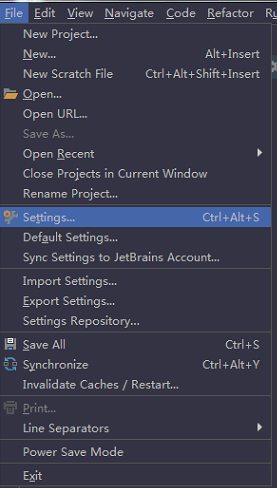
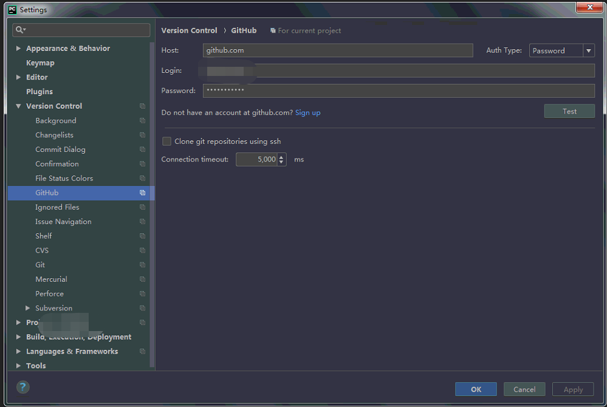
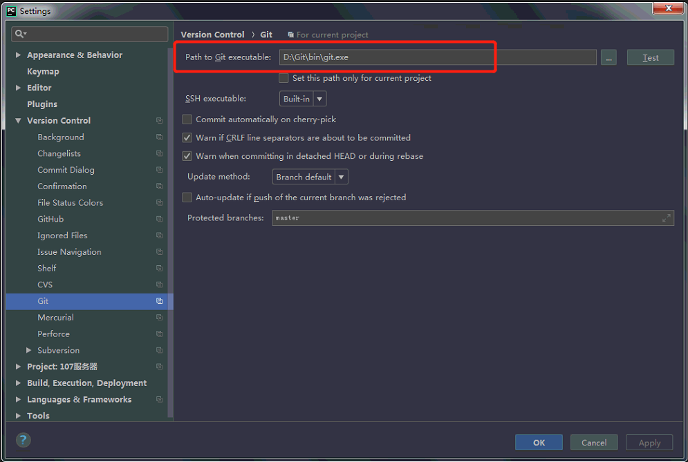
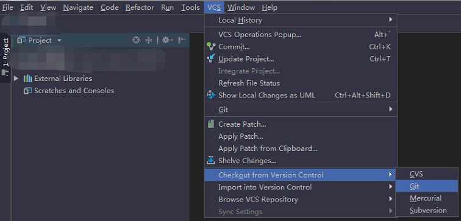
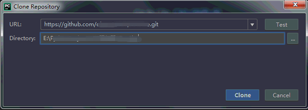

## 一、 准备工作
&emsp;首先你需要有一个github账户，同时电脑里安装git，
这些工作准备好了之后，可以开始我们的Pycharm(博主的Py
charm是2018.1版本)体验了。

## 二、 配置Pycharm的Git环境
&emsp;1.打开Pycharm，选择菜单栏的`File -> Settings ->
Version Control -> Github` :  
  
&emsp;2.输入自己的github账号:  
  
&emsp;3.在同个目录下选择Git，填上自己安装的Git路径:  
  

## 三、 从Github导入项目到本地
&emsp;1.选择菜单栏的`VCS -> Checkout from Version Control`，
选择 `Git`  
  
&emsp;2.在弹出的窗口的URL填上你要导入的Github上的项目地址，Directory
填上保存到本地的路径，然后点击Clone，克隆好了就选择打开  
  

## 四、 如何提交本地修改，更新到Github

